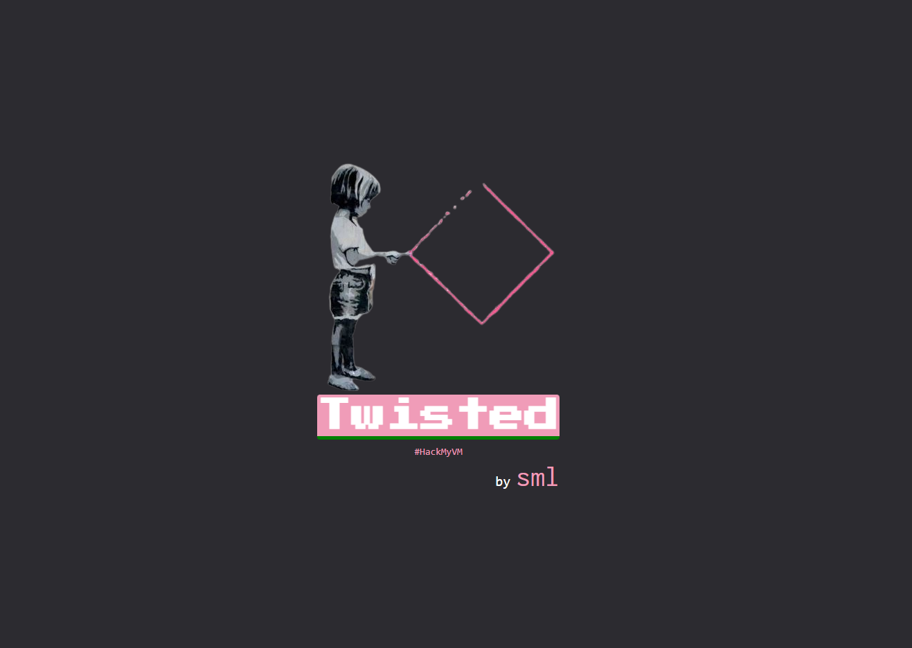
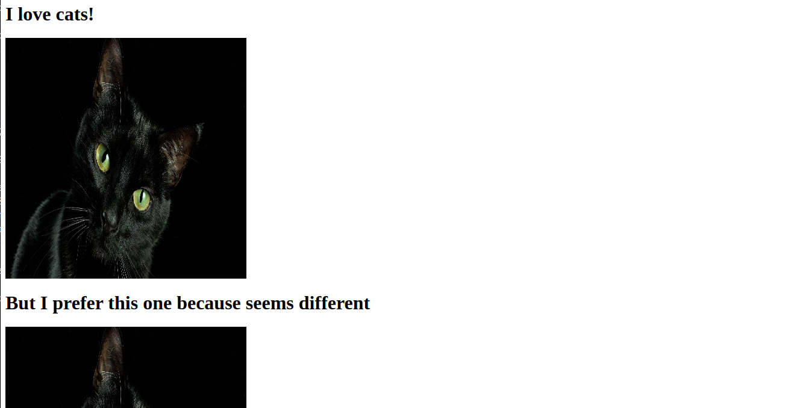
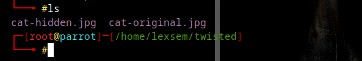

# HackMyVM machine
## Twisted
### Machine description
  - Machine in HackMyVM: [Twisted](https://hackmyvm.eu/machines/machine.php?vm=Twisted)
  - Machine type: Linux VM 
  - Machine difficulty: Easy



`arp-scan -l`:

```
192.168.1.66	08:00:27:9b:d8:c8
```

`nmap -p- -sC -sV 192.168.1.66`:

```
Nmap scan report for 192.168.1.66 (192.168.1.66)
Host is up (0.00035s latency).
Not shown: 65533 closed tcp ports (reset)
PORT     STATE SERVICE VERSION
80/tcp   open  http    nginx 1.14.2
|_http-server-header: nginx/1.14.2
|_http-title: Site doesn't have a title (text/html).
2222/tcp open  ssh     OpenSSH 7.9p1 Debian 10+deb10u2 (protocol 2.0)
| ssh-hostkey: 
|   2048 67:63:a0:c9:8b:7a:f3:42:ac:49:ab:a6:a7:3f:fc:ee (RSA)
|   256 8c:ce:87:47:f8:b8:1a:1a:78:e5:b7:ce:74:d7:f5:db (ECDSA)
|_  256 92:94:66:0b:92:d3:cf:7e:ff:e8:bf:3c:7b:41:b7:5a (ED25519)
MAC Address: 08:00:27:9B:D8:C8 (Oracle VirtualBox virtual NIC)
Service Info: OS: Linux; CPE: cpe:/o:linux:linux_kernel
```

Go on the 80 port:



We can see 2 photos, lets download them:

`wget http://192.168.1.66/cat-original.jpg`
`wget http://192.168.1.66/cat-hidden.jpg`





